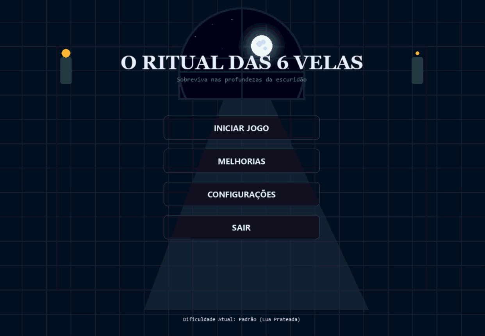

# O Ritual das 6 Velas — Arquitetura Tecnica & Documentacao de Engenharia

Um motor de jogo tatico de sobrevivencia em turnos com iluminacao 2D dinamica, sintetizador de audio procedural puramente matematico, maquina de estados desacoplada e renderizacao grafica em camadas com Pygame.

Para instrucoes de gameplay, arquetipos e regras de jogo, consulte o [GUIA_DE_COMO_JOGAR.md](GUIA_DE_COMO_JOGAR.md).

---

## Demonstracao Visual do Jogo

### Tela Inicial


### Exemplo de Gameplay — Parte 1
<video src="midia/gameplay_parte_1.mp4" width="100%" controls>
  Se o reprodutor de video nao carregar, <a href="midia/gameplay_parte_1.mp4">clique aqui para assistir ou baixar o arquivo da Parte 1</a>.
</video>

> *Nota: Caso o video acima nao seja exibido diretamente pelo navegador, voce pode [abrir ou baixar o arquivo de video da Parte 1 aqui](midia/gameplay_parte_1.mp4).*

### Exemplo de Gameplay — Parte 2
<video src="midia/gameplay_parte_2.mp4" width="100%" controls>
  Se o reprodutor de video nao carregar, <a href="midia/gameplay_parte_2.mp4">clique aqui para assistir ou baixar o arquivo da Parte 2</a>.
</video>

> *Nota: Caso o video acima nao seja exibido diretamente pelo navegador, voce pode [abrir ou baixar o arquivo de video da Parte 2 aqui](midia/gameplay_parte_2.mp4).*

---

## 1. Arquitetura do Sistema & Padroes de Projeto

O projeto adota uma arquitetura inspirada em **MVC (Model-View-Controller)** com forte desacoplamento entre simulacao logica, renderizacao grafica e sintese sonora:

```
                  ┌─────────────────────────────────┐
                  │             main.py             │
                  │ (Game Loop, Eventos & FSM)      │
                  └───────────────┬─────────────────┘
                                  │
         ┌────────────────────────┼────────────────────────┐
         │                        │                        │
         ▼                        ▼                        ▼
┌──────────────────┐    ┌──────────────────┐    ┌──────────────────┐
│  game_engine.py  │    │   renderer.py    │    │ sound_manager.py │
│ (Logica & Turnos)│    │(Pipeline Grafico)│    │(Audio Procedural)│
└────────┬─────────┘    └────────┬─────────┘    └──────────────────┘
         │                       │
         ▼                       │
┌──────────────────┐             │
│    models.py     │◄────────────┘
│ (Modelos & Dados)│
└──────────────────┘
```

### Padroes de Projeto Utilizados:
* **Finite State Machine (FSM):** Gerencia transicoes entre telas (`MENU`, `PERSONA_SELECT`, `ARTIFACT_SELECT`, `BLESSING_SELECT`, `RITUAL_SUMMARY`, `PLAYING`, `UPGRADES`, `SETTINGS`, `GAME_OVER`).
* **Model-View-Controller (MVC):** `models.py` (Dados puros), `renderer.py` (View desacoplada que aceita superficies/estados), `game_engine.py` (Controller/Regras de dominio).
* **Flyweight & Data Classes:** Encantamentos, velas e modificadores de arquetipos encapsulados em instancias leves.
* **Observer / Callback Hooking:** Notificacoes de eventos e gatilhos de sobrevida/ressurreicao desacoplados.

---

## 2. Estrutura Modular dos Componentes

| Modulo | Responsabilidade Tecnica | Principais Classes & Funcoes |
| :--- | :--- | :--- |
| [`main.py`](main.py) | Ponto de entrada, loop principal a 60 FPS, despacho de eventos (teclado/mouse), interpolacao de delta time e controle da FSM. | `main()`, `toggle_screen_mode()` |
| [`game_engine.py`](game_engine.py) | Mecanicas de jogo, regras de queima dinamica, turnos de espera, travas de acao por visita, sinergias de arquetipo e vitoria/derrota. | `GameEngine` |
| [`models.py`](models.py) | Estruturas de dados das entidades: pilastras, velas, itens, arquetipos, artefatos, bencaos e a criatura da penumbra. | `Pillar`, `Candle`, `Player`, `Artifact`, `Persona`, `Blessing`, `Creature`, `CandleItem` |
| [`renderer.py`](renderer.py) | Pipeline visual completo: iluminacao subtrativa 2D, renderizacao da vidraca gotica, nuvens em paralaxe, feixes volumetricos, interpolacoes e HUD. | `Renderer` |
| [`sound_manager.py`](sound_manager.py) | Sintetizador de audio 8-bits baseado em NumPy e Pygame Sound, gerando ondas quadradas, dente de serra e ruido proceduralmente sem arquivos de midia externos. | `SoundManager` |
| [`constants.py`](constants.py) | Dicionarios de cores hex/RGB, posicoes dos nos do salao, constantes de estado, mapeamento de dificuldades e metas de vitoria. | `PILLAR_POSITIONS`, `get_target_victory_turns()` |

---

## 3. Pipeline de Renderizacao & Iluminacao 2D

A renderizacao do gameplay em [`renderer.py`](renderer.py) e executada em camadas estritas (*render passes*) para garantir fidelidade visual, sombras dinamicas e efeitos de pos-processamento:

```
[Fill Background]
       │
       ▼
[Draw Floor & Corridors]
       │
       ▼
[Draw Gothic Window (Ceu, Lua/Sol, Nuvens Parallax, Moldura em Arco)]
       │
       ▼
[Draw Altar & 6 Pillars]
       │
       ▼
[Draw Particles & Player Sprite]
       │
       ▼
[Draw Subtractive Lighting & Encroaching Creature Eyes]
       │
       ▼
[Draw Window Volumetric Beams (God Rays / Moonbeams)]
       │
       ▼
[Draw Special FX (Camera Flash, Silver Burst, Purge Burst, Laser Beam)]
       │
       ▼
[Draw HUD & Compendium Modals]
```

### Iluminacao Subtrativa com Alpha Blending
Para simular a escuridao do salao e o campo de visao das chamas:
1. Uma superficie de escuridao opaca `dark_surf` preenche toda a tela com cor base `(8, 12, 20, base_darkness)`.
2. Para cada vela acesa, gera-se uma superficie radial com gradiente de luz e aplica-se `special_flags=pygame.BLEND_RGBA_SUB`.
3. Fontes de luz adicionais (Altar, Lampiao, Feixes) subtraem a escuridao em tempo real, criando iluminacao dinamica com circulos de luz suaves.

### Vidraca Gotica & Nuvens Procedurais
* **Geometria de Mascara:** Arco semicircular esticado recortado atraves de `pygame.draw.ellipse` e `pygame.draw.rect` aplicado com `BLEND_RGBA_MIN`.
* **Paralaxe Continuo:** Tres camadas de nuvens (`cloud_col_back`, `cloud_col_mid`, `cloud_col_fore`) deslocadas por funcoes lineares continuas moduladas no tempo (`t = time_elapsed`), operando a 60 FPS independentemente do avanco de turnos do jogador.
* **Trajetoria Celestial:** A posicao da Lua e calculada por interpolacao parabolica $(x, y) = f(\text{prog}, t)$:
  $$x = 50 + \text{prog} \cdot (W - 100) + 7 \cdot \sin(0.7t)$$
  $$y = 92 - 44 \cdot \sin(\text{prog} \cdot \pi) + 4 \cdot \cos(0.5t)$$

---

## 4. Sintese de Audio Procedural

O modulo [`sound_manager.py`](sound_manager.py) sintetiza todos os efeitos sonoros da partida em tempo de execucao via **NumPy**, sem depender de arquivos `.wav` ou `.mp3` no disco:

* **Taxa de Amostragem:** 22.050 Hz, 16-bit signed mono.
* **Formas de Onda:**
  * **Onda Quadrada (Square):** $\operatorname{sign}(\sin(2\pi f t))$
  * **Onda Dente de Serra (Sawtooth):** $2(f t - \lfloor f t + 0.5 \rfloor)$
  * **Onda Senoidal Pura (Sine):** $\sin(2\pi f t)$
  * **Ruido Branco (Noise):** Distribuicao uniforme $U(-1, 1)$
* **Envelopes ADSR:** Modulacao linear e exponencial de amplitude para evitar estalos (*clicks*) e conferir textura sonora retro/8-bits.

---

## 5. Mecanicas de Simulacao & Queima

A simulacao de turnos em [`game_engine.py`](game_engine.py) opera de forma deterministica:

1. **Decaimento Dinamico:** A cada acao que consome turno, as velas ativas reduzem em 1 turno de queima (exceto sob travas de congelamento como *Lampiao Espectral*, *Eclipse Prateado* ou *Super Queima da Lanterna*).
2. **Piso Minimo de Duracao:** Ao reacender uma pilastra, a nova duracao e calculada dinamicamente:
   $$\text{duracao} = \max(\text{piso minimo}, \text{queima base} - \text{apagadas} + \text{bonus})$$
3. **Aproximacao da Criatura:**
   $$\text{proximidade} = \frac{\max(0, \text{apagadas} - \text{expurgos})}{6} \times \text{taxa de furtividade}$$
   O deslocamento dos olhos das criaturas no salao interpola continuamente em direcao ao Altar Central via aproximacao assintotica.

---

## 6. Instalacao, Execucao & Requisitos

### Pre-requisitos
* Python 3.9 ou superior
* Pip

### Dependencias
As dependencias do projeto estao listadas em [`requirements.txt`](requirements.txt):
* `pygame>=2.5.0`
* `numpy>=1.24.0`

### Instalacao & Execucao

```bash
# 1. Clone o repositorio ou navegue ate a pasta do projeto:
cd "jogo de 6 velas"

# 2. Instale as dependencias:
pip install -r requirements.txt

# 3. Inicie o jogo:
python main.py
```

---

## 7. Testes Automatizados & Verificacao Headless

O jogo suporta execucao de testes automatizados e benchmarks em modo *headless* (sem display fisico ou servidor X11) atraves do driver virtual SDL:

```bash
python -c "
import os
os.environ['SDL_VIDEODRIVER'] = 'dummy'
import pygame, constants, game_engine, renderer

pygame.init()
screen = pygame.display.set_mode((1000, 700))
eng = game_engine.GameEngine('CROSS', constants.PERSONA_CARETAKER, constants.DIFFICULTY_NORMAL, constants.BLESSING_FIRE)
rend = renderer.Renderer(screen)
rend.render_gameplay(eng, (500, 350))
print('Simulacao Headless executada com sucesso!')
"
```
